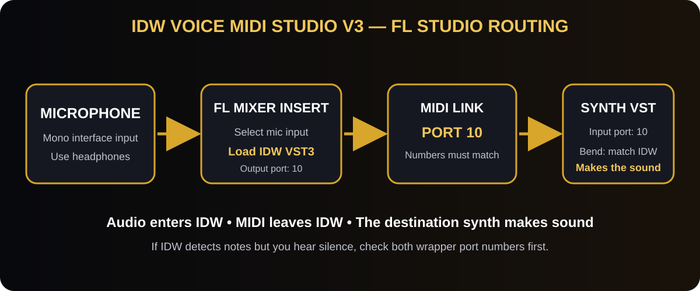

# Connect IDW Voice MIDI Studio Version 3 to FL Studio

IDW Voice MIDI Studio is a **voice-to-MIDI generator**, not a synthesizer. Your microphone goes into IDW; IDW sends MIDI notes to a separate instrument such as FLEX, Serum, Kontakt, Vital, or Omnisphere. If the meters move but you hear no instrument, the missing step is usually the matching MIDI port.

## Audio and microphone setup

1. Connect the microphone and headphones/audio interface.
2. In **Options > Audio settings**, select the interface's ASIO driver. If there is no manufacturer driver, use FL Studio ASIO.
3. Start with a **128-sample buffer**. Use 64 if stable; use 256 if audio clicks.
4. Open the Mixer (`F9`) and select an empty insert.
5. At the input selector, choose the microphone's **mono** input.
6. Load **IDW Voice MIDI Studio VST3** in an effect slot.
7. Speak into the mic. The IDW **INPUT** readout must move before MIDI routing can work.

## Send IDW MIDI to an instrument

1. In IDW's FL Studio wrapper, open the **gear icon**.
2. Open wrapper **Settings**, find **MIDI**, and set **Output port = 10**.
3. Add the destination synth to the Channel Rack.
4. Open the synth wrapper's **gear icon > Settings > MIDI**.
5. Set the synth's **Input port = 10**.

| Wrapper | Required setting |
|---|---|
| IDW Voice MIDI Studio | MIDI Output port = 10 |
| Destination synth | MIDI Input port = 10 |

Port 10 is only an example. Any unused port works when both numbers match. Do not confuse the wrapper MIDI port with Mixer Insert 10 or MIDI channel 10.

## First working settings

1. Load **Clean Vocal**.
2. Stay quiet and press **CALIBRATE NOISE**. Version 3 measures for one full second.
3. Start with **Confidence 0.75**, **Bend Range 2**, **Pitch Cal 0 cents**.
4. Set the destination synth's pitch bend to **±2 semitones**.
5. Sing a clear sustained `ah`, `oo`, or hum. IDW should display Hz and a MIDI note.
6. After basic tracking works, enable **SCALE LOCK** and choose the root/notes.

## Suggested settings

| Use | Buffer | Preset | Confidence | IDW bend | Synth bend |
|---|---:|---|---:|---:|---:|
| First test | 128 | Clean Vocal | 0.75 | 2 | ±2 |
| Fast live playing | 64–128 | Live Responsive | 0.68–0.75 | 2 | ±2 |
| Cleaner studio notes | 128–256 | Tight Tracking | 0.82–0.90 | 2 | ±2 |
| Vocal slides | 128 | Smooth Lead | 0.68–0.78 | 12 | ±12 |
| Beatboxing | 128 | Beatbox Drums | preset | n/a | n/a |
| MPE instrument | 128 | Expressive MPE | preset | 24 | MPE/±24 |

## Installed but not working

### Plugin is not listed

- Confirm the VST3 is in the system VST3 folder.
- Run **Options > Manage plugins > Find installed plugins**.
- Clear a failed-plugin flag and rescan. Match 64-bit plugin and 64-bit FL Studio.

### IDW input does not move

- Select the correct mono microphone input on the Mixer insert.
- Allow FL Studio microphone access in Windows/macOS privacy settings.
- Confirm another app is not holding the interface in exclusive mode.
- Test the mic on the Mixer insert with IDW bypassed.

### IDW detects notes, but the synth is silent

- Recheck: **IDW Output port = synth Input port**.
- Load the synth as an instrument/channel, not after IDW as an audio effect.
- Confirm the synth sounds when played with FL Studio's typing keyboard.
- Test first with a simple stock synth such as FLEX.

### Notes jump, chatter, or stick

- Load Tight Tracking and raise Confidence a little.
- Recalibrate away from fans, speakers, and room noise.
- Use headphones so synth audio does not bleed into the mic.
- Confirm only one IDW instance sends to the selected port.
- For a stuck note, stop playback and bypass/re-enable IDW.

### Slides are wrong or out of tune

- Match the synth bend range to IDW **exactly**.
- Reset Pitch Cal to 0 unless a tuner proves an offset is needed.
- If the synth has separate up/down ranges, set both equally.

### Delay is too noticeable

- Use the interface manufacturer's ASIO driver.
- Reduce the buffer from 256 to 128, then 64 if stable.
- Bypass look-ahead limiters, linear-phase EQ, mastering chains, and oversampling while performing.

## Beatbox routing

Load **Beatbox Drums**. IDW sends kick 36, snare 38, and hi-hat 42 on MIDI channel 10. The drum plugin must use those General MIDI notes or remap its pads. The wrapper port still must match.

## Final check

- IDW INPUT moves.
- IDW shows Hz and a MIDI note.
- IDW Output port matches synth Input port.
- The synth sounds when played directly.
- IDW Bend Range matches the synth bend range.
